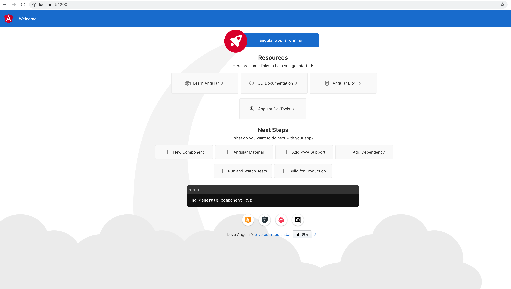

## Compose sample

### Use with Docker Development Environments

You can open this sample in the Dev Environments feature of Docker Desktop version 4.12 or later.

[Open in Docker Dev Environments ](https://open.docker.com/dashboard/dev-envs?url=https://github.com/docker/awesome-compose/tree/master/angular)

### Angular service

Project structure:

```
.
├── angular
│   ├── Dockerfile
│   ├── ...
│   ├── ...
│   ....
└── compose.yaml
```

[_compose.yaml_](compose.yaml)

```
services:
  web:
    build: angular
    ports:
    - 4200:4200
    ...

```

The compose file defines an application with one service `angular`. The image for the service is built with the Dockerfile inside the `angular` directory (build parameter).

When deploying the application, docker compose maps the container port 4200 to the same port on the host as specified in the file.
Make sure port 4200 is not being used by another container, otherwise the port should be changed.

## Deploy with docker compose

```
$ docker-compose up -d
Creating network "angular_default" with the default driver
Building angular
Step 1/7 : FROM node:10
10: Pulling from library/node
c0c53f743a40: Pull complete
...
...
Successfully built efea5cef6851
Successfully tagged angular_web:latest
WARNING: Image for service web was built because it did not already exist. To rebuild this image you must use `docker-compose build` or `docker-compose up --build`.
Creating angular_web_1 ... done
```

## Expected result

Listing containers must show a container running and the port mapping as below:

```
$ docker ps
CONTAINER ID        IMAGE               COMMAND                  CREATED             STATUS              PORTS                  NAMES
6884c228388e        angular_web         "docker-entrypoint.s…"   42 seconds ago      Up 36 seconds       0.0.0.0:4200->4200/tcp angular_web_1

```

After the application starts, navigate to `http://localhost:4200` in your web browser.



Stop and remove the container

```
$ docker-compose down
```
