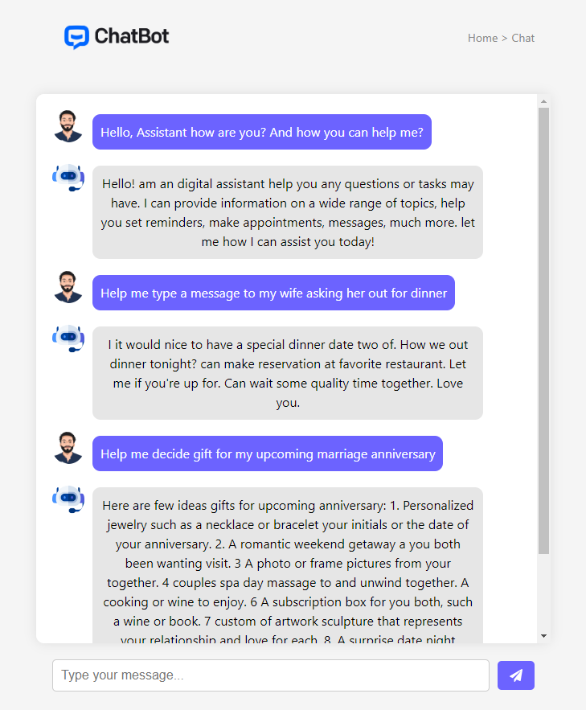
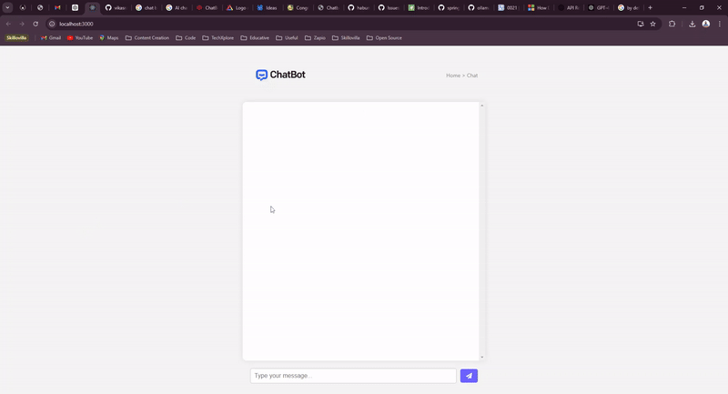

## Compose sample application
### Java application with Spring AI and Reactjs

Project structure:
```
├── backend
│   ├── Dockerfile
├── frontend
│   ├── ...
│   └── Dockerfile
|── README.md
├── compose.yaml
```

[_compose.yaml_](compose.yaml)
```
services:
  springboot-app:
    build: 
      context: ./backend
      dockerfile: Dockerfile
    ports:
      - "8080:8080"
    environment:
      - SPRING_AI_OPENAI_API_KEY="<OPENAI_API_KEY>"
    networks:
      - app-network

  react-ui:
    build: 
      context: ./frontend
      dockerfile: Dockerfile
    ports:
      - "3000:80" # Serving on port 3000 (Nginx default port 80)
    networks:
      - app-network
networks:
  app-network:
    driver: bridge
```
The compose file defines an application with two services `backend` and `frontend`.
When deploying the application, docker compose maps port 8080 of the backend service container to port 8080 of the host as specified in the file. And maps port 3000 of the frontend service container to port 3000 of th hostas specified in the file.
Make sure port 8080 and 3000 on the host is not already being in use.

## Deploy with docker compose

```
$ docker compose up -d
[+] Building 0.0s (0/0)  docker:default
[+] Building 0.0s (0/0)  docker:defaultr reading preface from client //./pipe/docker_engine: file has already been closed
[+] Building 174.2s (27/27) FINISHED
...
[+] Running 3/3
 ✔ Network spring-ai-react-chatbot_app-network         Created
 ✔ Container spring-ai-react-chatbot-springboot-app-1  Started 
 ✔ Container spring-ai-react-chatbot-react-ui-1        Started  
```

## Expected result

Listing containers must show two containers running and the port mapping as below:
```
$ docker ps
CONTAINER ID   IMAGE                                    COMMAND                  CREATED         STATUS         PORTS                    NAMES
792d11abca1c   spring-ai-react-chatbot-springboot-app   "sh -c 'java -jar ap…"   4 minutes ago   Up 4 minutes   0.0.0.0:8080->8080/tcp   spring-ai-react-chatbot-springboot-app-1
b311be4f9ae3   spring-ai-react-chatbot-react-ui         "/docker-entrypoint.…"   4 minutes ago   Up 4 minutes   0.0.0.0:3000->80/tcp     spring-ai-react-chatbot-react-ui-1
```

After the application starts, navigate to `http://localhost:3000` in your web browse:





Stop and remove the containers
```
$ docker compose down
[+] Running 3/3
 ✔ Container spring-ai-react-chatbot-springboot-app-1  Removed
 ✔ Container spring-ai-react-chatbot-react-ui-1        Removed
 ✔ Network spring-ai-react-chatbot_app-network         Removed  
```
